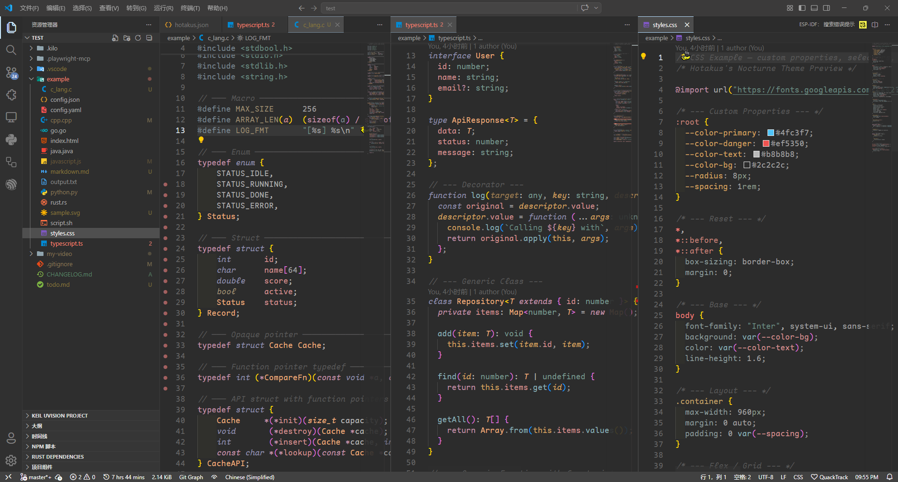
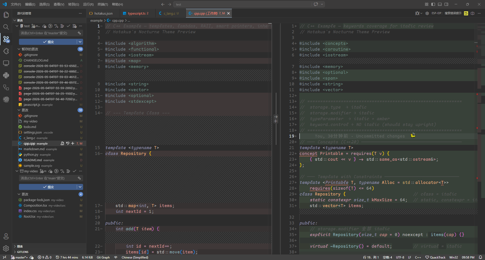

<h1 align="center">Hotakus's Nocturne</h1>

<p align="center">
  
  
  
  
  
  
  <a href="./README.md"></a>
</p>

<p align="center"><em>A dark VS Code theme with low-contrast colors and semantic highlighting.</em></p>

<p align="center">
  
</p>
<p align="center">
  
</p>

---

## ✨ Features

- Low-contrast dark, easy on the eyes
- 17-color layered palette for variables, types, strings, etc.
- Strategic italics — declaration keywords only, flow control stays upright
- Low-profile Git — muted SCM and subtle diff backgrounds

## 📦 Install

```bash
code --install-extension hotakus.hotakus
```

Or search **Hotakus's Nocturne** in Extensions (`Ctrl+Shift+X`).

## 🌐 Languages

| Language | Example |
|----------|---------|
| TypeScript | [typescript.ts](example/typescript.ts) |
| JavaScript | [javascript.js](example/javascript.js) |
| C | [c_lang.c](example/c_lang.c) |
| C++ | [cpp.cpp](example/cpp.cpp) |
| Python | [python.py](example/python.py) |
| Rust | [rust.rs](example/rust.rs) |
| Go | [go.go](example/go.go) |
| Java | [java.java](example/java.java) |
| HTML | [index.html](example/index.html) |
| CSS | [styles.css](example/styles.css) |
| JSON | [config.json](example/config.json) |
| YAML | [config.yaml](example/config.yaml) |
| Markdown | [markdown.md](example/markdown.md) |
| SVG | [sample.svg](example/sample.svg) |
| Shell | [script.sh](example/script.sh) |

---

<p align="center">
  <sub>中文 <a href="./README.md">here</a> | MIT © Hotakus</sub>
</p>
